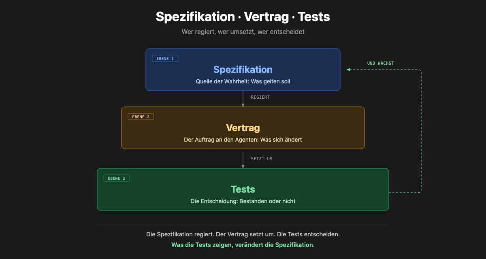

<p align="center">
  
</p>

<h1 align="center">Agentic AI in der Praxis</h1>
<p align="center"><b>Vom Spec zum produktiven Workflow</b> · IT4Science Days 2026 · 3h Workshop (09:00–12:00) · Deutsch</p>
<p align="center">Mi, <b>30.09.2026</b> · Manfred-Eigen-Saal, MPI-NAT · <a href="https://plan.events.mpg.de/event/670/contributions/4047/">Indico-Eintrag</a> · wird gestreamt &amp; aufgezeichnet</p>

> **⚠️ Migrated from Codeberg → GitHub**: This repository lives on [GitHub](https://github.com/tobias-weiss-ai-xr/IT4Science-Days-2026-agentic-ai-workshop). A Codeberg mirror is kept in sync manually: [graphwiz-ai/IT4Science-Days-2026-agentic-ai-workshop](https://codeberg.org/graphwiz-ai/IT4Science-Days-2026-agentic-ai-workshop) (Branch `master`).
>
> **Diese README ist die einzige Quelle der Wahrheit für den Ablauf.** Die Marp-Folien liegen unter `pre-presentation-builder/presentations/`.
> Nach jeder Folien-Änderung: `./build.sh` — rendert das Deck und prüft die Fußzeilen-Überlappung (muss PASS liefern).
> `./build.sh --list` gibt zusätzlich das Folienverzeichnis mit Nummern aus. Einmalig nötig: `npm install -g @marp-team/marp-cli`.
> Vollständiger Ablauf (Branch → Build-Gate → Merge → beide Remotes): siehe [CONTRIBUTING.md](CONTRIBUTING.md).

---

## Über den Workshop

Dieser Workshop auf den IT4Science Days 2026 zeigt praxisnah, wie Large Language Models heute **agentisch** genutzt werden können, welche neuen Möglichkeiten sich daraus ergeben und wie solche Ansätze sinnvoll in eigene Projekte integriert werden können.

Im Mittelpunkt stehen zwei **Anwendungen**: erst direkt agentisch ohne Spec, dann dasselbe Thema via Spec aufs Demo-Repo — jede Teilnehmende verlässt den Raum mit einem eigenen, CI-validierten Research-Repo und einem selbst geschriebenen, implementierten **Spec-Change**.

### Lernziele

1. **Primär**: ein eigenes, CI-validiertes Research-Repo aufsetzen und die Spec · Contract · Test-Pyramide darin wiedererkennen.
2. Harnesses und Modelle für den eigenen Anwendungsfall einschätzen können (Ranking-Kriterien, nicht Trends).
3. Einen konkreten nächsten Schritt für das eigene Projekt formulieren (Outcomes-Block, Exit-Ticket).

### Voraussetzungen

- GitHub-Account (vorab anlegen), `git` und Python ≥ 3.11 lokal, Browser
- Kein Dev-Hintergrund nötig — Dev-Jargon wird auf den Folien erläutert (CI, Harness, PR …)
- Kein Bot-Baukasten-Kurs: Wir starten auf Agent-Ebene (Harness, Spec, Pipeline) — Chat-Basics setzen wir voraus, Dev-Wissen nicht
- Optional: SAIA/GWDG-Zugang für eigene LLM-Nutzung; für sensible Daten zeigen wir lokale Modelle

### Harnesses installieren (vorab, ~5 min)

**OpenCode** ([Docs](https://opencode.ai/docs)):

```bash
curl -fsSL https://opencode.ai/install | bash   # oder: npm install -g opencode-ai
```

**pi** ([pi.dev](https://pi.dev), braucht Node ≥ 22.19):

```bash
curl -fsSL https://pi.dev/install.sh | sh        # oder: npm install -g --ignore-scripts @earendil-works/pi-coding-agent
```

Wer SAIA/GWDG-Modelle nutzen will: nach dem Start das passende Plugin (`pi-saia-plugin` · `opencode-saia-plugin`) installieren — es registriert die GWDG-Modelle automatisch.

> Ablauf- und Facilitation-Details für Referenten: [`pre-presentation-builder/runbook-it4science-2026.md`](pre-presentation-builder/runbook-it4science-2026.md) (Arc-Mapping, Formative-Assessment-Maßnahmen M1–M9, Fallback-Plan).

### Die zentrale Metapher: Spec · Contract · Test

Der ganze Workshop folgt einer Pyramide, die wir später live anwenden:

> **Spec governs → Contract implements → Tests verify → Spec evolves.**

| Ebene | Was | Rolle |
|-------|-----|-------|
| **Spec** (oben) | Verhalten als Verträge — SHALL/MUST/SHOULD, Given/When/Then | Source of Truth, das „Warum" |
| **Contract** (Mitte) | Delta-Spec — proposal → design → specs → tasks | der Prompt, den der Agent bekommt |
| **Test** (unten) | Verifikation — validate · --check · CI pass/fail | objektive Entscheidung |



## Referenten

| Name | Institution |
|------|-------------|
| **Christian Uhl** | Zentrum für angewandte Informatik und Data Science, Universität Gießen |
| **Tobias Weiß** | DevOps Engineer, Universität Marburg — [tobias-weiss.org](https://tobias-weiss.org) |

## Agenda (3h, 09:00–12:00)

| Block | Verantwortung |
|-------|---------------|
| Ankommen, Vorstellung — **Praxisbeispiele der Referenten** (wie wir agentic AI nutzen) + **TN-Vorstellungsrunde**, Ablauf | Christian |
| Grundlagen & Definition — Was ist agentisches Arbeiten? | Christian |
| Aktuelle Entwicklungen bei den Foundation Modellen | Christian + Tobias |
| Open-Source Toolbox — Harnesses (OpenCode, pi) + Tooling | Tobias + Christian |
| ☕ **Pause 10:10–10:20** | — |
| **Anwendung 1: Ihr Thema direkt agentisch — ohne Spec** — opencode/pi, Harness, Blitzlicht-Thema | Tobias |
| **Theorie zu Specs**: Spezifikation & Token — kompakt: Anforderungen als Treiber, Modell-Routing, Caching | Christian + Tobias |
| **Anwendung 2: Ihr Thema via Spec aufs Demo-Repo** (Teil 2 von 2, auf dem Repo aus Teil 1) | Christian |
| ☕ **Pause 11:25–11:30** | — |
| **Outcomes** — TN präsentieren ihre Ergebnisse | Tobias |
| Q&A, Diskussion, Wrap Up | Tobias |

**Lernlogik der Reihenfolge:**
Einstieg mit zwei **Praxisbeispielen** der Referenten und **TN-Vorstellungsrunde** (Wünsche sammeln) → Grundlage → Werkzeuge → **sofort selbst anwenden (Research Repo)** → Vertiefung kompakt (Spec & Token) → **Spec selbst anwenden** → **Outcomes präsentieren** → Austausch.

> Details und Rankings zu Foundation Models & Toolbox: [`pre-presentation-builder/research-foundation-models-toolbox.md`](pre-presentation-builder/research-foundation-models-toolbox.md).

## Foundation Models — aktuelle Entwicklungen (Auszug)

Einordnung, warum agentisches Arbeiten 2026 möglich ist:

- **Reasoning-Modelle** reif — Rechenzeit skalieren statt nur Parameter.
- **Kontextlängen explodieren** (200K → 1M+ Token) — ganze Codebases & Specs im Kontext.
- **MCP** (Model Context Protocol) wird Standard-Tool-Schnittstelle.
- **Tool-Use & Multi-Agent** sind Produktionsreif, nicht mehr Demo.
- **OpenSource holt auf** (Qwen, GLM, DeepSeek, GPT-OSS, Llama, Gemma) — **Kosten-Kollaps**.
- **Lokale & souveräne Modelle** (Ollama, vLLM, llama.cpp) — DSGVO-freundlich.

## Open-Source Toolbox

### Harnesses (Steuerungsebene über dem Modell)

> Gleiche Modelle, unterschiedliche Ergebnisse — **je nach Harness**.

| Harness | Rolle | Setzen wir ein für |
|---------|-------|--------------------|
| **OpenCode** | CLI-Coding-Agent — Multi-Model, LSP, Plugins, Skills, MCP | tägliche Coding-Agents |
| **pi** | minimaler Terminal-Harness, erweiterbar (Skills, Packages, Themes) · [pi.dev/packages](https://pi.dev/packages) | kontrollierte Workflows · dieser Workshop |
| **zot** | schlankes Agent-Harness mit TUI + JSON-RPC | Headless & Automation |

### Weiteres Tooling

| Tool | Funktion |
|------|----------|
| **OpenSpec** | Spec-driven Development — Delta-Specs als Agenten-Prompts |
| **SAIA-Plugins** | `pi-saia-plugin`, `opencode-saia-plugin`, `zot-saia-plugin` — GWDG Chat-AI-Modelle, Auto-Registrierung |
| **oh-my-opencode** | Routing je Aufgabe (benannte Agents), AST-Grep (25 Sprachen), Background-Agents |
| **Superpowers Skills** | TDD, Debugging, Brainstorming, Review als wiederverwendbare Routinen |
| **rtk** | CLI-Proxy: filtert Bash-/Tool-Output — −60–90 % Input-Token, ein Rust-Binary |
| **ponytail / caveman** | Prompt-Skills — minimale Lösungen (YAGNI) + knappe Prosa, Output-Token diszipliniert |
| **Ollama / vLLM / llama.cpp** | Lokales Modell-Serving auf eigener Hardware |

> **Das Modell ist das Gehirn, die Workflows sind der Muskel.**

## Anwendung 1: Direkt agentisch — ohne Spec

**Was Sie tun (ca. 15 min):** Starten Sie Ihren Harness ([OpenCode](#harnesses-installieren-vorab-5-min) oder [pi](#harnesses-installieren-vorab-5-min)) und stellen Sie **Ihr Thema X aus dem Blitzlicht als einen einzelnen Prompt** — ohne Gerüst, ohne Dateien, ohne Spec. Sammeln Sie, was der Agent liefert.

Am Ende drei Fragen an das Ergebnis: **Geprüft? Zitierbar? Wiederholbar?**

> Die Baseline-Erfahrung des Vormittags: So stark ein Agent ohne Spec auch wirkt — das Ergebnis bleibt ein Sammel-Haufen. Parken Sie Ihre Treffer, **Anwendung 2 nimmt sie wieder auf.**

## Anwendung 2: Ihr Thema via Spec aufs Demo-Repo

Das Herzstück. [skeleton-research](https://github.com/tobias-weiss-ai-xr/skeleton-research) ist ein forkbares Skeleton für eine **datengetriebene, auto-validierte, agentische Literatur-Review**. Auf die Pyramide übertragen: `papers.yaml` = **Spec**, Pipeline/AGENTS.md = **Contract**, CI = **Test**. CI entdeckt wöchentlich neue Paper (arXiv, OpenAlex, dblp, Crossref, EuropePMC), validiert und deployt die durchsuchbare Paper-Browser-Seite auf GitHub Pages.

**Was Sie tun (ca. 25 min):**

1. **Kopie holen** — das Demo-Repo wird Ihres
2. **Themenfeld setzen** — Ihre Ordnung für Thema X (`config/taxonomy.yaml`)
3. **Seeden** — 3–5 Treffer aus Anwendung 1 in `papers.yaml`; die Validierung entscheidet, was überlebt
4. **Laufen lassen** — prüfen, erzeugen, berichten (Pipeline)
5. **Veröffentlichen** — Push; CI validiert & deployt auf GitHub Pages

Danach ein eigener Mini-**OpenSpec-Change** obendrauf — dieselbe Struktur, jetzt als Agenten-Prompt. Referenz: fertiger Change **`add-research-gap-analysis`** in [ai-literacy-research](https://github.com/tobias-weiss-ai-xr/ai-literacy-research) (`openspec/changes/archive/2026-08-23-add-research-gap-analysis`).

```bash
# Jump-Start (Schritte 1–4)
git clone https://github.com/tobias-weiss-ai-xr/skeleton-research.git my-topic-research
cd my-topic-research
$EDITOR config/taxonomy.yaml                      # 2. Themenfeld setzen
python3 scripts/fetch/fetch_new_papers.py --local # 3. Seeden (oder Treffer aus Anw. 1 eintragen)
python3 scripts/validate_papers.py && python3 scripts/generate_readme.py \
  && python3 scripts/standard_stats.py && python3 scripts/analysis/generate_reports.py  # 4.
git add -A && git commit -m "bootstrap corpus" && git push   # 5. → CI

# OpenSpec-Change (Anwendung 2, Teil 2)
openspec new change thema-x
# → Agent füllt proposal → design → specs → tasks → implementieren
# → openspec validate --changes entscheidet, ob es zählt
```

> Regel aus der Pyramide: Tasks erst **done**, wenn die Verifikation (CI/Validate) grün ist.

## Arbeitsmaterialien

- `pre-presentation-builder/presentations/it4science-days-2026-agentic-ai-workshop.md` — Marp-Folien (`.html` = gerendert)
- `pre-presentation-builder/research-foundation-models-toolbox.md` — Recherche: Foundation Models & Toolbox (Ranking)
- `assets/spec-contract-test-pyramid.png` — die Spec·Contract·Test-Metapher
- `assets/teaser.png` · `assets/teaser-banner.png` — Banner für Social/Titel

## Links

- [IT4Science Days Eventseite](https://plan.events.mpg.de/event/670/)
- [Impuls zu SpecDrivenDevelopment (GWDG News)](https://gwdg.de/about-us/gwdg-news/2026/GN_05-2026_www.pdf#page=14)
- [skeleton-research](https://github.com/tobias-weiss-ai-xr/skeleton-research) — forkbares Research-Corpus-Skeleton
- [ai-literacy-research](https://github.com/tobias-weiss-ai-xr/ai-literacy-research) — OpenSpec-Showcase (Research-Gap-Analyse)
- [pi-saia-plugin](https://codeberg.org/tobias-weiss-ai-xr/pi-saia-plugin) · [opencode-saia-plugin](https://github.com/tobias-weiss-ai-xr/opencode-saia-plugin) (GitHub = Primary, Codeberg = Mirror) · zot-saia-plugin
- [OpenCode](https://github.com/sst/opencode) · [OpenSpec](https://www.npmjs.com/package/openspec) · [pi](https://pi.dev) · [zot](https://www.zot.sh)
