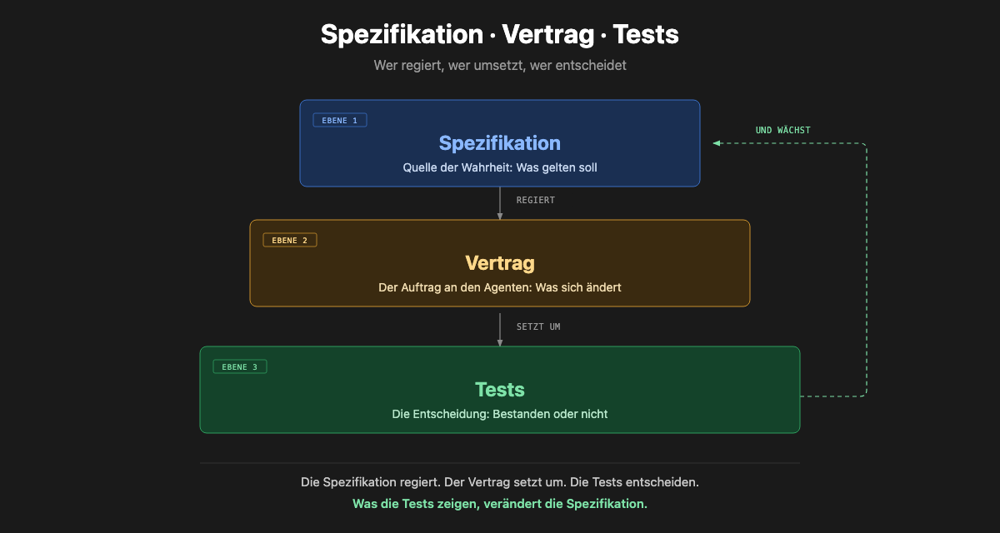

<!-- _class: lead -->

# Agentic AI in der Praxis

## Vom Spec zum produktiven Workflow — ein Workshop mit Hands-on

**IT4Science Days 2026 · Agentic AI Workshop** · 09:00–12:00

Christian Uhl · Tobias Weiß

<!-- notes:
Begrüßung (~1 min). Kurz vorstellen: Wer wir sind, worum es geht.
Ziel: Teilnehmende verlassen den Raum mit eigenem Research-Repo, das per CI
validiert wird, und haben einen OpenSpec-Change selbst angewendet.
-->

---

<div class="speaker speaker-christian">👤 Christian Uhl</div>

## Wer wir sind — zwei Hooks

<div class="columns smaller">
<div>

**Christian Uhl**
Zentrum für angewandte Informatik & Data Science, Uni Gießen

> **Mein Hook:** Agentic AI in Lehre & Datenprojekten —
> vom Prompt zum **validierten Ergebnis**, nicht zum Chat-Verlauf.

</div>
<div>

**Tobias Weiß**
DevOps Engineer, Uni Marburg

> **Mein Hook:** Research-Pipelines & IT-Betrieb agentisch —
> dieses Foliendeck selbst ist ein Artefakt derselben Pyramide:
> mit pi + OpenSpec aus Specs gebaut.

</div>
</div>

<!-- notes:
CHRISTIAN — führt durch die Vorstellung (~3 min); Tobias liefert Hook 2 selbst (~1 min).
Hooks personalisieren! Vor dem Workshop final formulieren — konkret werden:
je EIN greifbares Beispiel, wie agentic AI im eigenen Alltag arbeitet.
-->

---

<div class="speaker speaker-christian">👤 Christian Uhl</div>

## Ihre Reihe — Blitzlicht

- **Name · Fachrichtung · eine Aufgabe**, die agentisch für euch arbeiten soll.
- ≤ 30 Sekunden je Person — wir sammeln Wünsche an die Whiteboard-Wand.
- Diese Wünsche checken wir am Ende gegen die Outcomes.

> Bei großen Runden: 5–6 Stichworte aus dem Raum, Rest per Karte/Zettel.

<!-- notes:
CHRISTIAN — moderiert (~4 min). Die gesammelten Wünsche sichtbar notieren —
Wrap-Up greift sie auf. Zeit hart timen.
-->

---

<!-- _class: lead -->

# Agenda (3h)

| Zeit | Block | Dauer | Wer |
|------|-------|-------|-----|
| 09:00–09:15 | Ankommen, Vorstellung (Hooks + TN-Runde), Ablauf | 15 min | Christian |
| 09:15–09:30 | Grundlagen & Definition | 15 min | Christian |
| 09:30–09:50 | Foundation Models — aktuelle Entwicklungen | 20 min | Christian + Tobias |
| 09:50–10:10 | Open-Source Toolbox | 20 min | Tobias + Christian |
| 10:10–10:20 | ☕ Pause | 10 min | — |
| 10:20–10:45 | Anwendung 1: Eigenes Research-Repo | 25 min | Tobias |
| 10:45–11:00 | Spec Driven & Token-optimized Development | 15 min | Christian + Tobias |
| 11:00–11:25 | Anwendung 2: Spec selbst anwenden | 25 min | Christian |
| 11:25–11:30 | ☕ Pause | 5 min | — |
| 11:30–11:45 | Outcomes — TN präsentieren ihre Ergebnisse | 15 min | Tobias |
| 11:45–12:00 | Q&A, Diskussion, Wrap Up | 15 min | Tobias |

<!-- notes:
Agenda auf 1 min durchgehen. Zwei Hands-on-Blöcke: (1) eigenes Research-Repo,
(2) OpenSpec selbst anwenden. Christian: Vorstellung, Grundlagen (2), Lead Block 7 (Spec/Token).
Tobias: Toolbox (4), Anwendung 1 (6), Outcomes (10), Q&A (11). Gemeinsam: 3, 7.
-->

---

<!-- _class: lead -->

<div class="speaker speaker-christian">👤 Christian Uhl</div>

# Grundlagen: Das Spec · Contract · Test Modell

<!-- notes:
CHRISTIAN — Sektions-Trenner. Einführung der zentralen Metapher des Workshops.
-->

---

<div class="speaker speaker-christian">👤 Christian Uhl</div>

## Eine Metapher für den ganzen Workshop



<!-- notes:
CHRISTIAN — die Pyramide als roter Faden. Spec oben (Source of Truth), Contract in
der Mitte (Delta-Spec = Agenten-Prompt), Tests unten (objektive Verifikation).
Wir kommen auf dieses Bild immer wieder zurück.
-->

---

<div class="speaker speaker-christian">👤 Christian Uhl</div>

## Was bedeutet die Pyramide?

| Ebene | Was | Rolle |
|-------|-----|-------|
| **Spec** (oben) | Verhalten als Verträge — SHALL/MUST/SHOULD, Given/When/Then | Source of Truth, das „Warum" |
| **Contract** (Mitte) | Delta-Spec — proposal → design → specs → tasks | der Prompt, den der Agent bekommt |
| **Test** (unten) | Verifikation — validate · --check · CI pass/fail | objektive Entscheidung |

> **Spec governs → Contract implements → Tests verify → Spec evolves.**

<!-- notes:
CHRISTIAN — die drei Ebenen kurz erläutern. Dieses Muster taucht in skeleton-research
(papers.yaml=Spec, AGENTS.md=Pipeline, CI=Test) UND in OpenSpec wieder auf.
-->

---

<!-- _class: lead -->

<div class="speaker speaker-christian">👤 Christian Uhl</div>

# Grundlagen & Definition

<!-- notes:
CHRISTIAN — Block 1 · 09:15–09:30 (15 min).
-->

---

<div class="speaker speaker-christian">👤 Christian Uhl</div>

## Was ist agentisches Arbeiten? — Definition

- Der **Engpass ist nicht das Programmieren**, sondern die **Anforderungsklärung**.
- Ein Agent erhält einen **kurzen, präzisen Auftrag** — und einen **stabilen Kontext** (Repo, Specs, Skills, Tools).
- Das Ergebnis ist nur so gut wie der **Vertrag** davor.
- **Agentisches Arbeiten** = das Verfassen klarer Verträge für Maschinen, statt Anweisungen für Menschen.

<div class="todo">
  <strong>Platzhalter Christian:</strong> Definition & Abgrenzung (Agent vs. Assistent vs. Automatisierung),
  Praxisbeispiel aus Uni Gießen / ZAID. 5–8 min.
</div>

<!-- notes:
CHRISTIAN — Block 1 · 09:15–09:30. Weg von "Prompting" hin zu "Contracts".
-->

---

<!-- _class: lead -->

<div class="speaker speaker-christian">👤 Christian Uhl</div>

# Foundation Models — aktuelle Entwicklungen

<!-- notes:
CHRISTIAN — Block 2 · 09:30–09:50 (20 min), Lead. Tobias ergänzt die
Tooling-/Souveränitäts-Sicht. Thema nach Relevanz gerankt.
-->

---

<div class="speaker speaker-christian">👤 Christian Uhl</div>

## Wo stehen die Modelle 2026? — Ranking

<div class="columns smaller">
<div>

**1. Reasoning-Modelle** reif
- Rechenzeit skalieren statt nur Parameter — o-Serie, DeepSeek-R1, Claude-Thinking.
- Planen, verifizieren, korrigieren — nicht nur kompletieren.

**2. Kontextlängen explodieren**
- 200K → 1M+ Token (Gemini 3.1 Pro).
- Ganze Codebases & Specs im Kontext → echte Agenten möglich.

**3. MCP wird Standard**
- Model Context Protocol als „USB-C der Tools".
- Modell ↔ Tool-Kompatibilität entkoppelt.

</div>
<div>

**4. Funktionen-Calls & Tool-Use reifen**
- Strukturierte Ausgaben, parallele Tool-Calls, Multi-Agent.
- Nicht mehr Demo, sondern Produktionsreife.

**5. OpenSource holt auf**
- Qwen 3.6/3.5 (MoE), GLM 4.7/5, DeepSeek V4, GPT-OSS, Llama, Gemma 4.
- **Kosten-Kollaps**: für viele Tasks reicht ein kleines Modell.

**6. Lokale & souveräne Modelle**
- Ollama, vLLM, llama.cpp auf eigener Hardware.
- Souveränität + Datenschutz (DSGVO) ohne Qualitätsverlust.

</div>
</div>

> Beispiel-Landschaft (SAIA-Katalog, Stand 09/2026): GLM 4.7 · Qwen3.8-2.4T-A95B (MoE) · Qwen3-Coder-Next · DevStral 2 · DeepSeek V4 Flash · Llama 3.1 8B — Routing über Katalog-Aliase (`best-for-*` / `budget` / `fastest`).

<!-- notes:
CHRISTIAN — Ranking 1–6 nach Relevanz für agentisches Arbeiten. Tobias springt
nach #5/#6 ein (2 min Praxis-Sicht): SAIA-Katalog — welche Modelle laufen
tatsächlich, Kosten-Kollaps konkret, Routing-Preview → vertieft in Block 5.
-->

---

<div class="speaker speaker-christian">👤 Christian Uhl</div>

## Foundation Models — Praxis-Einordnung

<div class="todo">
  <strong>Platzhalter Christian:</strong> Aktuelle Modell-Landschaft (OpenSource vs.
  proprietär), Kontextlänge, Agentic-Fähigkeiten, euren Ausblick 2026/2027.
  Gerne Live-Demos eurer Lieblingsmodelle. 10–15 min.
</div>

<!-- notes:
CHRISTIAN — eigene Inhalte. Bitte vorab ausfüllen.
-->

---

<!-- _class: lead -->

<div class="speaker speaker-tobias">👤 Tobias Weiß</div>

# Open-Source Toolbox

<!-- notes:
TOBIAS — Block 3 · 09:50–10:10 (20 min), Lead. Christian ergänzt.
Die Harnesses nach Stage/Use-Case ranken.
-->

---

<div class="speaker speaker-tobias">👤 Tobias Weiß</div>

## Drei Harnesses im Vergleich

<div class="columns smaller">
<div>

**1. OpenCode** — der Allrounder
- CLI-Coding-Agent, TUI, `opencode run "…"` — Modell/Provider je Agent wählbar.
- LSP, Plugins, Skills, MCP im Kern.
- Mit OmO-Plugin: AST-Grep (25 Sprachen), parallele Background-Agents.

**2. pi** — das Minimal-Harness
- Minimaler Terminal-Harness, stark erweiterbar.
- Skills · Prompt-Templates · Extensions · Themes.
- Philosophie: „Adapt pi, nicht umgekehrt" — nichts eingebacken, alles baubar.

**3. zot** — das schlanke Agent-Harness
- Single-Binary in Go, TUI + JSON-RPC (Prozess-Integration).
- Extensions, Slash-Commands, MCP.
- Ollama & llama.cpp anbindbar → lokale Modelle, souverän.
- `zot "prompt"` · `zot -p` · `zot rpc`.

</div>
<div>

**Ranking nach Einsatz:**

| Platz | Tool | Für |
|-------|------|-----|
| 1 | **OpenCode** | tägliche Coding-Agents, Routing |
| 2 | **pi** | kontrollierte, minimalistische Workflows |
| 3 | **zot** | RPC/Headless-Integration, eigene Automation |

> Ein **Harness ist die Steuerungsebene**: gleiche Modelle, unterschiedliche Ergebnisse — je nach Harness.

**Claude Code** (kommerziell) als Vergleichsmaßstab — Open-Source spielt oben mit.

</div>
</div>

<!-- notes:
TOBIAS — Timing (20 min): 12 min Vergleich inkl. Live-Demo — derselbe Prompt in
allen dreien, Ergebnis-Differenz zeigen: „gleiche Modelle, unterschiedliche
Ergebnisse" wird bewiesen, nicht behauptet. 3 min Ranking. Danach Tooling-Folie.
Ranking-Sicht: OpenCode fürs Tagesgeschäft, pi für minimal & erweiterbar, zot
für Skripting/RPC. Pi steckt dahinter, wie dieser Workshop entstanden ist.
-->

---

<div class="speaker speaker-tobias">👤 Tobias Weiß</div>

## Weiteres Agentic-Tooling

| Tool | Funktion |
|------|----------|
| **OpenSpec** | Spec-driven Development — Delta-Specs als Agenten-Prompts |
| **SAIA Accelerator** | Plugin für OpenCode/zot/pi — GWDG Chat-AI-Modelle, Auto-Sync |
| **oh-my-opencode** | Routing je Aufgabe (Sisyphus, Prometheus, Oracle …), AST-Grep, Background-Agents |
| **skeleton-research** | Forkbares Corpus-Skeleton — gleich hands-on in Anwendung 1 |
| **Superpowers Skills** | TDD, Debugging, Brainstorming, Review — als wiederverwendbare Routinen |
| **Ollama / vLLM / llama.cpp** | Lokale Modell-Serving auf eigener Hardware |

> **Das Modell ist das Gehirn, die Workflows sind der Muskel.**

<!-- notes:
TOBIAS — Tooling-Landschaft ranken. OpenSpec ist die Brücke zu Block 5 (Spec & Token).
oh-my-opencode leitet innerhalb von Block 5 zum Token-Teil über.
-->

---

<!-- _class: lead -->


# ☕ Pause

10 Minuten.

<!-- notes:
Pause 10:10–10:20.
-->

---

<!-- _class: lead -->

<div class="speaker speaker-tobias">👤 Tobias Weiß</div>

# Anwendung 1: Eigenes Research-Repo

<!-- notes:
TOBIAS — Block 4 · 10:20–10:45 (25 min), Lead (Christian unterstützt). Herzstück: Wie Teilnehmende mit
skeleton-research ihre eigene Forschung unterstützen. Tobias führt das Repo.
-->

---

<div class="speaker speaker-tobias">👤 Tobias Weiß</div>

## skeleton-research: Ein Fork für deine Forschung

**Jeder verlässt den Raum mit einem eigenen, CI-validierten Research-Repo.**

- **Literatur-Corpus als reiner Text**: `papers.yaml` = Source of Truth.
- **Eine Konfiguration** (`config/taxonomy.yaml`) steuert das ganze System.
- Pipeline: **validieren → generieren → Statistiken → Reports**.
- **CI** sucht wöchentlich neue Papers und stellt sie auf **GitHub Pages**.

```bash
git clone https://github.com/tobias-weiss-ai-xr/skeleton-research.git my-research
cd my-research
# → config/taxonomy.yaml anpassen, papers.yaml seeden, Pipeline laufen lassen 🚀
```

<!-- notes:
TOBIAS — Kernnutzen: "Wie unterstützt das meine Forschung?" Ein Repo = strukturierter,
reproduzierbarer, auto-validierter Stand des Literaturwissens. CI macht es lebendig.
-->

---

<div class="speaker speaker-tobias">👤 Tobias Weiß</div>

## Die Pipeline — jede Datei hat einen Zweck

```
config/taxonomy.yaml  ──►  papers.yaml  ──►  validate ──►  generate_readme
                                                  │             │
                             standard_stats ◄─────┘             ▼
                                                  │        generate_reports
                                                   ▼              │
                                              CI pass/fail        ▼
                                                            docs/ (GitHub Pages)
```

<div class="unix"><strong>Ein Tool, ein Job.</strong> Jedes Skript tut genau eine Sache
(validate / generate / stats / reports) — und sie komponieren sich zur Pipeline.</div>
<div class="unix"><strong>Text ist die Schnittstelle.</strong> YAML + Markdown, kein GUI nötig.
Ein Mensch kann genauso lesen wie ein Agent.</div>
<div class="unix"><strong>Die Pipeline ist der Richter.</strong> Vom Agenten erzeugte Edits müssen
die Validierung bestehen — objektiv, nicht nach Meinung.</div>

<!-- notes:
TOBIAS — der Unix-Geist wird durch die Struktur gezeigt, nicht benannt:
ein Tool/ein Job, Text als Schnittstelle, Pipeline als objektiver Richter.
papers.yaml = Spec, Pipeline = Contract, CI = Test → die Pyramide in Aktion.
-->

---

<div class="speaker speaker-tobias">👤 Tobias Weiß</div>

## Jump-Start in 5 Schritten

1. **Forken**: `skeleton-research` klonen — sauberer Ausgangspunkt.
2. **Taxonomie setzen**: `config/taxonomy.yaml` auf dein Thema zuschneiden.
    ```yaml
    categories:
      - id: agentic-ai
        name: "Agentic AI"
        description: "Agentic workflows & harnesses"
    ```
3. **Seeden**: `papers.yaml` mit deinen Start-Papers füllen (echte URLs!).
4. **Pipeline laufen lassen**: `python scripts/pipeline.py` — validiert & generiert.
5. **Pushen**: CI validiert, generiert, deployed auf GitHub Pages.

> **Nie generierte Dateien von Hand editieren** — sie regenerieren sich aus `papers.yaml`.

<!-- notes:
TOBIAS — live zeigen. Wichtig: „Niemals generierte Dateien editieren" (README.md,
docs/papers.json, reports) — sie werden regeneriert. Das ist "Lösche & Regeneriere".
-->

---

<div class="speaker speaker-tobias">👤 Tobias Weiß</div>

## Wie der Agent deine Forschung unterstützt

| Agentische Aufgabe | Werkzeug im Repo |
|--------------------|------------------|
| Neue Papers entdecken | Discovery: arXiv, OpenAlex, dblp, Crossref, EUPMC, GitHub/GitLab/Codeberg |
| Dem Topic zuordnen | automatische Taxonomie-Zuordnung |
| Validiert halten | `validate_papers.py` — echte URLs, Schema, keine Erfindungen |
| README & Berichte | `generate_readme.py`, `generate_reports.py` |
| Trends & Zeitgeist | `trend_scanner.py`, `landscape_analyzer.py`, `topic_planner.py` |
| Kurz-Briefings | `brief_generator.py` |

> **Du kuratierst, der Agent erledigt das Rauschen.** CI hält den Corpus gesund — jede Woche ein Discovery-PR.

<!-- notes:
TOBIAS — das ist der eigentliche Wert: nicht das Repo selbst, sondern dass der
Agent die Pflege (Discovery, Validierung, Trends) übernimmt, während der Mensch
die Qualität kuratiert. Der Mensch bleibt in der Verantwortung.
-->

---

<div class="speaker speaker-tobias">👤 Tobias Weiß</div>

## AGENTS.md — der Contract für den Agenten

```yaml
# AGENTS.md (Auszug)
- NEVER edit README.md — it is auto-generated from papers.yaml.
- NEVER edit docs/papers.json, statistics.json or docs/research/*.md by hand.
- NEVER invent papers; every entry MUST have a real, resolvable URL.
- After ANY papers.yaml change, ALWAYS re-run the full pipeline.
- Validate (exit 0) before committing.
```

<div class="unix"><strong>Die Spec ist der Vertrag.</strong> Der Agent wird nicht im Prompt
gefragt, sondern per Datei geführt — stabil, wiederholbar, review-bar.
Zuwiderhandlungen deckt die Pipeline objektiv auf.</div>

<!-- notes:
TOBIAS — AGENTS.md = die "Contract"-Ebene der Pyramide. Kein Gespräch pro Session,
kein Wiedereinlernen — die Regeln liegen im Repo. Die Pipeline erzwingt sie.
-->

---

<!-- _class: lead -->

<div class="speaker speaker-christian">👤 Christian Uhl</div>

# Spec Driven & Token-optimized Development

<!-- notes:
CHRISTIAN + TOBIAS — Block 5 · 10:45–11:00 (15 min), kompakt zusammengelegt.
Timing: ~6 min SDD-Kern (Spec → Delta-Spec → Verify), ~2 min Showcase-Beispiel
(kürzbar/überspringbar), ~7 min Token-Teil (Tobias: Routing, Caching, Prinzipien).
Die Pyramide in Reinkultur: Anforderungen als Tests für Agenten.
-->

---

<div class="speaker speaker-christian">👤 Christian Uhl</div>

## SDD — Specs führen, Delta-Specs liefern

| Ebene | Ort | Rolle |
|-------|-----|-------|
| **Specs** (Source of Truth) | `openspec/specs/` | Verhalten als Verträge — SHALL/MUST/SHOULD, Given/When/Then |
| **Changes** (Delta) | `openspec/changes/<name>/` | proposal · design · specs · tasks — der Agenten-Prompt |
| **Archive** (Decision Log) | `openspec/archive/` | „Warum" bleibt in 6 Monaten beantwortbar |

> Specs sind der **Vertrag zwischen Mensch und Agent** — klarer Scope, überprüfbare Acceptance Criteria.

<!-- notes:
CHRISTIAN — Grundprinzip Spec→Change→Archive. Das ist genau die Pyramide:
Spec oben (Source of Truth), Change-Mitte (Contract), Tests unten (Verifikation).
-->

---

<div class="speaker speaker-christian">👤 Christian Uhl</div>

## Ein Change in Aktion: Research-Gap-Analyse

```yaml
# openspec/specs/analysis-reporting/spec.md  (Source of Truth)
ADDED: Behavioral capability:
  - id: research-gap-analysis
    requirement: >-
      the system SHALL rank research areas by a gap score, combining
      publication thinness with momentum, and reproduce within 3 months
```

```yaml
# openspec/changes/archive/2026-08-23-add-research-gap-analysis/tasks.md  (Contract)
- [ ] design gap-score formula (thinness × momentum)
- [ ] implement gap-score computation in stats module
- [ ] add validate + CI check for reproducible rank
- [ ] write spec-delta + acceptance test
```

<!-- notes:
CHRISTIAN — konkret durchgehen. Der Agent bekommt die exakte Differenz, keine
Klärungsrunden. Die Spec ist behaviorale Anforderung; die Tasks zählen den Fortschritt.
-->

---

<div class="speaker speaker-tobias">👤 Tobias Weiß</div>

## OpenSpec-Showcase: ai-literacy-research

**Ein live implementierter Change steht bereit** — im Repo `ai-literacy-research`.

- **Corpus**: 9.600+ Papers, 20 Kategorien, lebende systematische Übersicht.
- **OpenSpec-Struktur** am echten Beispiel:
  - `openspec/specs/` — paper-corpus · discovery-pipeline · analysis-reporting (Source of Truth)
  - `openspec/changes/archive/2026-08-23-add-research-gap-analysis/` — proposal → design → specs → tasks
  
> Gap-Score = **0.6 × Dünne (thinness) + 0.4 × Momentum + Floor-Bonus**
> → rankt Bereiche mit wenig Literatur und starkem Wachstum.

<!-- notes:
TOBIAS — der fertige Change als Referenz für den Hands-on-Block 6. Die Teilnehmenden
sehen eine echte, vollständige Spec/Change/Tasks-Struktur und können sie nachbauen.
-->

---

<div class="speaker speaker-tobias">👤 Tobias Weiß</div>

## Weniger Token, gleiche Qualität

> Praktisch gemessen: **3–5× weniger Token** bei gleicher Ergebnisqualität — zwei Hebel.

<div class="columns smaller">
<div>

**Routing: das richtige Modell pro Aufgabe**
- Klein & schnell für Muster-Erkennung, groß & langsam für Denk-Aufgaben.
- oh-my-opencode: benannte Agents (Sisyphus, Prometheus, Oracle…) → Modell je Kategorie.
- SAIA: Katalog-Aliase als Routing — `best-for-coding` → Qwen3-Coder-Next, `best-for-agentic` → GLM 4.7, `budget` → DeepSeek V4 Flash.

**Caching & Kontext-Hygiene**
- Prompt-/KV-Caching: Kontext über Steps wiederverwenden.
- Kompaktion (auto + prune): nur das Behalten, was zählt.
- Kleiner, präziser Kontext = weniger Wiederholung.

</div>
<div>

<div class="unix"><strong>Klein ist schön.</strong> Ein kleines Modell für eine kleine Aufgabe —
nicht jede Aufgabe braucht den größten Verstand.</div>
<div class="unix"><strong>Komponiere, nicht wiederhole.</strong> Skills & Specs vorschreiben,
statt in jeder Session alles neu zu erklären.</div>
<div class="unix"><strong>Speichere Wissen, nicht Prompt-Stücke.</strong>
pi-memory / Knowledge Graph persistieren Erfahrung außerhalb des Kontexts.</div>

</div>
</div>

<!-- notes:
TOBIAS — 10 min: 5 min Routing (Live: SAIA-Tier-Wahl für dieselbe Aufgabe),
3 min Caching/Kontext-Hygiene, 2 min Prinzipien → Brücke zu Anwendung 2
(„ihr Spec ist auch Token-Optimierung: der Contract ersetzt Wiederholung").
Der Geist dahinter: kleine präzise Bausteine, die komponiert werden.
-->

---

<!-- _class: lead -->

<div class="speaker speaker-christian">👤 Christian Uhl</div>

# Anwendung 2: Spec selbst anwenden

<!-- notes:
CHRISTIAN — Block 6 · 11:00–11:25 (25 min), Lead (Tobias unterstützt). Hands-on: Teilnehmende bauen ihren eigenen
Mini-OpenSpec-Change (ideal im eigenen, zuvor erstellten Research-Repo).
-->

---

<div class="speaker speaker-christian">👤 Christian Uhl</div>

## Übung 2 — dein eigenes Research-Gap-Spec

- **Ziel**: eine behaviorale Spec + Tasks für eine neue Auswertung in deinem Research-Repo.
- Mini-Aufgabe als **OpenSpec-Change** strukturieren: `proposal.md` · `specs/` · `tasks.md`.
- Agent (OpenCode / pi / zot / SAIA) implementieren lassen — kleine, abgegrenzte Aufgabe.
- Eine Regel der Pyramide erzwingen: **Tasks erst „done", wenn die Verifikation (CI/--check) grün ist**.

```bash
openspec new change trend-auswertung --description "Trend-Auswertung pro Kategorie"
# → Agent füllt proposal → design → specs → tasks (openspec instructions <artifact>)
# → Agent implementieren → openspec validate --changes → CI
```

<!-- notes:
CHRISTIAN — 20–25 min. Referenz: der fertige add-research-gap-analysis-Change in
ai-literacy-research. Ergebnis-Sampling: 2–3 kurze Demos.
-->

---

<div class="speaker speaker-christian">👤 Christian Uhl</div>

## Übung 2 — Ergebnis-Kriterien

| Ziel | Erfüllt, wenn … |
|------|-----------------|
| **Spec** geschrieben | SHALL-Satz mit Given/When/Then, Scope klar |
| **Contract** definiert | Change mit proposal, specs, tasks |
| **Test** grün | Validierung/CI besteht, Reproduzierbarkeit belegt |

> **Spec governs → Contract implements → Tests verify → Spec evolves.**
> Jede:r verlässt den Raum mit beidem: eigenem Research-Repo **und** eigenem Mini-Change.

<!-- notes:
CHRISTIAN — Ergebnis-Check gegen die Pyramide. Das ist der "Aha-Moment": dieselbe
Struktur in übergreifter und in eigener Repo-Größe.
-->

---

<!-- _class: lead -->


# ☕ Pause

5 Minuten.

<!-- notes:
Pause 11:25–11:30.
-->

---

<!-- _class: lead -->

<div class="speaker speaker-tobias">👤 Tobias Weiß</div>

# Outcomes — eure Ergebnisse

<!-- notes:
TOBIAS — Block 7 · 11:30–11:45 (15 min), Moderation. 3–4 Freiwillige präsentieren
à 3–4 min. Mit der stärksten Demo starten. Zeit hart timen: bei 3 min Warnsignal.
-->

---

<div class="speaker speaker-tobias">👤 Tobias Weiß</div>

## Outcomes — das zeigen wir

- **3–4 Freiwillige**, je 3–4 min: eigenes Research-Repo + eigener Mini-Change.
- Live-Demo oder Screenshot — Hauptsache **Pipeline grün, Change validiert**.
- Bewertung an der Pyramide: ein SHALL-Satz (Spec), ein Change (Contract), ein grüner Check (Test).

> Das Publikum reviewed mit: Was würde die Pyramide an deinem Projekt bemängeln?

<!-- notes:
TOBIAS — Ergebnis-Kriterien wie in Übung 2. Wünsche aus der Vorstellungsrunde
aufgreifen: „Hat das jemand von euch angestoßen?“
-->

---

<!-- _class: lead -->

<div class="speaker speaker-tobias">👤 Tobias Weiß</div>

# Q&A · Diskussion · Wrap Up

<!-- notes:
TOBIAS — Block 8 · 11:45–12:00 (15 min), Moderation. Offene Fragen, Diskussion,
Wrap-Up — Wünsche aus der Vorstellungsrunde Revue passieren lassen.
-->

---

<div class="speaker speaker-tobias">👤 Tobias Weiß</div>

## Das Muster auf eigene Projekte übertragen

1. **Klein starten**: eine Spec für ein vorhandenes Modul (Given/When/Then).
2. **Delta-Specs nutzen**: erster Change mit 3 Tasks → Agent implementieren lassen.
3. **Verifikation erzwingen**: Tests + CI als Pflicht — Agenten iterieren, bis grün.
4. **Wissen persistieren**: pi-memory / Knowledge Graph ab Session 1 — nicht in Prompt-Stücken.
5. **Loop institutionalisieren**: Betriebserkenntnisse werden neue Changes (Spec evolves).

> Die **Pyramide** ist überall: papers.yaml=Spec · Pipeline=Contract · CI=Test —
> und genau so bei OpenSpec.

<!-- notes:
TOBIAS — jeder Block des Workshops folgte derselben Pyramide. Jetzt aufs eigene
Projekt übertragen.
-->

---

<div class="speaker speaker-tobias">👤 Tobias Weiß</div>

## Resources

- **OpenCode** — github.com/sst/opencode
- **pi** — pi.dev · @earendil-works/pi-coding-agent
- **zot** — zot.sh · github.com/patriceckhart/zot
- **OpenSpec** — npmjs.com/package/openspec (CLI v1.9)
- **SAIA Accelerator** — codeberg.org/graphwiz-ai/opencode-saia-plugin (Branch `main`)
- **oh-my-opencode** — github.com/code-yeongyu/oh-my-opencode
- **skeleton-research** — github.com/tobias-weiss-ai-xr/skeleton-research
- **ai-literacy-research** — github.com/tobias-weiss-ai-xr/ai-literacy-research
- **Superpowers Skills** — github.com/obra/superpowers

<!-- notes:
Links können als QR-Code oder Handout ergänzt werden.
-->

---

<!-- _class: lead -->

<div class="speaker speaker-tobias">👤 Tobias Weiß</div>

# Questions & Discussion

Vielen Dank!

Diskussionsthemen:
- Wo liegt das größte Potenzial — und wo die größte Skepsis?
- Governance-Regeln für agentische Systeme?
- Eigene Modelle auf lokaler Hardware (Souveränität)?
- Agentische Literatur-Reviews für deine Forschung?

<!-- notes:
TOBIAS — Moderation: Erfahrungsaustausch & Anwendungsfälle aus Teilnehmenden-Perspektive.
-->

---

# License

This work is licensed under a [Creative Commons Attribution 4.0 International License](https://creativecommons.org/licenses/by/4.0/).

Christian Uhl · Tobias Weiß — except where otherwise noted.
